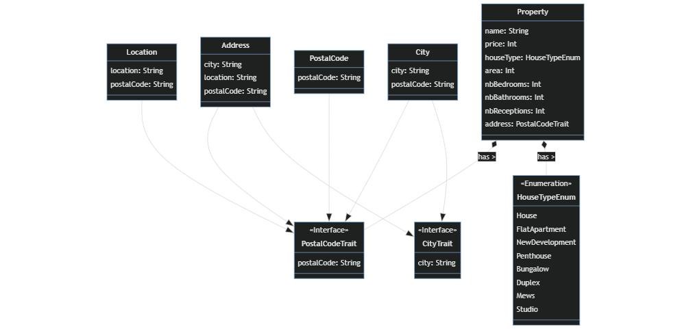

# Scala project
Il s'agit d'un projet en Scala dont le but est d'interpéter un fichier csv qui contient les données de propriétés d'Angleterre.  Ensuite, les données sont traitées de différentes manières. 

## Diagram de class
Voici le diagramme de classe conçu à partir des données du fichier csv.

## Features
Le traitement des données s'est fait au travers de 5 query différentes.

- Affichage du prix par mètre carré de chaque propriété
- Affichage du prix moyen par type de maison
- Affichage des propriétés par type de maison
- Affichage du nombre de pièce pondéré par propriété de plus de 8000m2
- Affichage du nombre de type de maison pour une ville

Nous avons également utilisé de l'asynchrone pour récupérer le nombre de type de maison pour deux villes.

